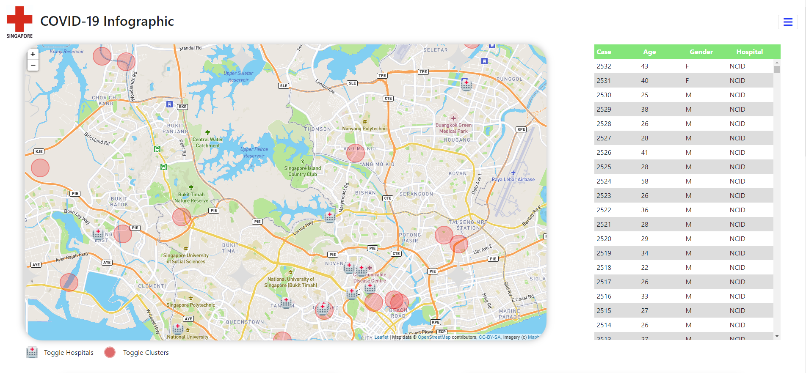

# COVID 19 Infographic - Singapore
This is an interactive infographic website, aimed towards providing viewers with a visualization on the raw dataset provided on the Singapore government website on recent COVID-19 cases. The website contains various elements that informs viewers on the situation in Singapore - ``` Affected areas/clusters, Location of hospitals, Details on each cases and the rate of transmission. ```

Project Purpose: Given how rapid cases grow, data on the newly reported cases were disseminated sparesly and viewer's intepretation of the data could differ without proper context. For instance, an increase in cases by 300 does not mean National University Hospital is running out of beds and overwhelmed. Another example of judgement without context is that on the third week of March, a higher number of new cases might not indicate growing rate of transmission, it could turn out to be a slowing rate of increase, which is a positive implication.

Hence, my motivation for this project is to shed light on the implications of the new data shared on the Government website, so as to provide users with a holistic view on the situation being reported.

A live demo of the website can be accessed here: 

https://kwokcheong.github.io/Project-2-Singapore-Covid-Insights/

## UX
> These are tough times, and my heart goes out to all healthcare workers at the front lines.

My goal is to visualize how our current healthcare resources are holding up against the rising COVID-19 cases in Singapore and to present it to viewers through the use of an interactive map, bar chart, line and pie chart. Starting with a leaflet map at the header, viewers will have direct access to the hospital information by clicking on the icon on the map to reveal the desired information they are looking for. Cluster zones are also demarcated to reveal the proximity to viewer's location. Both of which can be toggled on/off depending on the objectives of the viewer. 

Users can scroll down to see the graphical information derived from the government dataset. Alternatively they can click on the [Nav] hamburger icon -> data to shortcut to the graph anchor. I adopted a white and red color palatte to the website as it represents the cleaniness of hospital facilities, which also happens to coincide with Singapore's country flag colors. I segregated the information into seperate containers, giving each a generous amount of space and space between one another for ease of reading.


## Technologies
* HTML
* CSS
* Javascript
* [JQuery](https://jquery.com/) 
* [LeafletJS](https://leafletjs.com/) 
* [axios](https://github.com/axios/axios) 
* [csvtoJson](https://github.com/Keyang/node-csvtojson) 
* [Bootstrap version 4.4](https://getbootstrap.com/) for toggle of tabs navigation  


## Features
1. Data directs user to the anchor point on page (index.html).
2. Use of MaxBounds on leaflet map to prevent panning to set focus on Singapore.
3. Toggle buttons serve as legends and ulitity to hide/show datapoints on leaflet map.
4. Icons on leaflet map are interactive, click on hospital icon to reveal data on number of patients, number of bed, address and hotline.
5. Cluster icons are animated to produce the blinking effect. 
6. Hover over on graph datapoints to reveal exact figures on each point. 
7. Click on legend ie: AGE DEMOGRAPHIC -> 25-54 to uncheck from graph. 
8. Responsive to mobile IOS, tablet IOS, Android device. 


## DATA MANIPULATION 

#### Number of COVID-19 Patients in Each Hospital
- Achieved using Dictionary. 
- Each Hospital abbreviation was used as the 'key' and 'value' is the count (Number of times appeared). 
- Iterate through whole dataset and increment value to respective key. 

#### Increase in COVID-19 Patients by Week
- Given the date tagged along with the case id, we can manipulate the data to show increase by week
- Apply date.split('/') to obtain month, date in array
- Set weeks to be Q1,Q2,Q3,Q4 and increment respectively into the array using 
    ```weekCount[0 + (4 * j)]++;```
    where j is the month. Jan = 0, Feb = 1. 

#### Rate of Transmission per week
- formula used: 
    ```increase = Increase ÷ Original Number × 100```
- First obtain the cumulative sum from the increase per week info. 
- Use the increase and divide it by the info from cumulative sum 
    ```ie: 17 -> 20 is an increase by 17.64% ```


## Features Left to Implement
* I would like to add a search bar such that it would show the hospitals user was looking for. 
* For functionality, I would allow users to click on the graph data to filter and only show selected dataset for that particular hospital/date. 

## Testing
Employers will be able to view the leaflet map and graph the instance they enter the webpage.

All links have been tested to ensure correct re-direction to desired destination.
1. Logo,home -> `index.html`
2. Data -> `index.html#mydata`


To ensure compatibility and responsiveness, the site was tested across multiple browsers such as Chrome, Safari and Internet Explorer and on iOS devices - iPhone Xs Max, iPad and iPad Pro.

## Interesting Bugs found
1. Graph requires reload if width is reduced using computer window, else they would bunch up. 


# Deployment
This site can be viewed [here](https://github.com/kwokcheong/Project-2-Singapore-Covid-Insights.git). This site is hosted using GitHub pages, deployed directly from the master branch. The deployed site will update automatically upon new commits to the master branch. In order for the site to deploy correctly on GitHub pages, the landing page must be named index.html.

To run locally, you can clone this repository directly into the editor of your choice by pasting git clone git@github.com:kwokcheong/Project-2-Singapore-Covid-Insights.git into your terminal. To cut ties with this GitHub repository, type git remote rm origin into the terminal.

# Credits

### Content
All contents have been written by me.


### Media

* logo image from navigation bar page taken from - SINGAPORE RED CROSS
* Hospital and Circle Icon on Leaflet taken from - pngwing.com

### DataSet 

Data obtained from https://www.gov.sg/features/covid-19
Cluster Data was self compiled from news source - StraitsTimes, ChannelNewsAsia

### Acknowledgements
Font converted to CSS using https://fonts.google.com/

Bootstrap4 - NavBar, footer

This is for educational use.